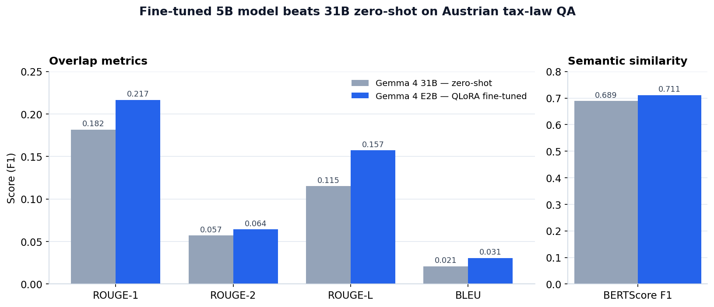

# Evaluating LLMs on Austrian Tax Law: Fine-Tuned 5B vs. Zero-Shot 31B

*A 643-question German-language benchmark with automatic metrics and a manual failure-mode analysis. 
Can a small fine-tuned model beat a much larger zero-shot one on domain-specific legal QA?*

This project compares two ways of answering **643 Austrian tax-law questions** in German: a large general-purpose model used **zero-shot** through an API, and a small model **fine-tuned with QLoRA** on a single free Colab GPU. Both are scored against human-written reference answers using ROUGE, BLEU, and BERTScore, followed by a detailed error analysis of *how* each model fails.

---

## TL;DR — Key Result

**The 5.1B QLoRA fine-tuned model (Gemma 4 E2B) beat the 31B zero-shot model (Gemma 4 31B) on all five metrics** — despite being ~6× smaller and trained for only 150 steps on a single 16 GB T4 GPU. On this specialized task, domain fine-tuning on general German-law data outweighed raw model scale.

| Model | ROUGE-1 | ROUGE-2 | ROUGE-L | BLEU | BERTScore F1 |
|---|---|---|---|---|---|
| Gemma 4 31B — zero-shot | 0.1816 | 0.0571 | 0.1152 | 0.0208 | 0.6891 |
| **Gemma 4 E2B — QLoRA fine-tuned** | **0.2167** | **0.0643** | **0.1572** | **0.0307** | **0.7113** |



The gap is largest on ROUGE-L (+0.042) and BLEU (+0.010), meaning fine-tuning mostly helped the model match the **structure and length** of the expected answers — not just the vocabulary.

---

## Overview

Austrian tax law is a narrow, high-precision domain: answers must cite the right statutes (EStG, KStG, BAO, UStG) and specific paragraphs. The question this project asks is practical: **is it better to prompt a very large model, or to cheaply fine-tune a small one?**

To answer it, I evaluate two contrasting approaches on the same 643-question benchmark:

- **Approach A — scale, no training:** a 31B instruction-tuned model, prompted zero-shot as a tax-law expert.
- **Approach B — small, but adapted:** a ~5B model fine-tuned with QLoRA on German-law Q&A data.

Both produce German-language answers under identical evaluation conditions.

---

## Approach

### The two models

**Model 1 — Gemma 4 31B (zero-shot, API inference).**
Accessed through the Google AI Studio API. The model relies entirely on its pre-training knowledge plus a system prompt instructing it to act as an Austrian tax-law expert and cite relevant paragraphs.

- Model ID: `gemma-4-31b-it` · ~31B parameters
- Sampling: temperature = 0.1 (low, for factual consistency)
- Inference: sequential API calls with a 5 s delay (free-tier rate limit) and retry logic for 429/503 errors via `tenacity`

**Model 2 — Gemma 4 E2B (QLoRA fine-tuned).**
A smaller model fine-tuned on domain data with QLoRA (Quantized Low-Rank Adaptation): the base model is loaded in 4-bit precision and frozen, while only small LoRA adapter layers are trained.

- Model ID: `google/gemma-4-E2B-it` · 2.3B effective (5.1B with embeddings)
- Trainable parameters: 4,644,864 — just **0.09%** of the model
- Sampling: temperature = 0.1
- Inference: local GPU with Unsloth's optimized 2× inference mode

### Fine-tuning data

- **Dataset:** `DomainLLM/german-law-qa` (Hugging Face)
- **Size:** 14,160 German-law question–answer pairs
- **Domain:** *general* German law — deliberately broader than Austrian tax law, which turns out to matter (see Error Analysis)
- **Format:** each pair rendered into Gemma's chat template
  (`<start_of_turn>user … <end_of_turn> <start_of_turn>model … <end_of_turn>`)

### QLoRA in brief

QLoRA makes it possible to fine-tune on a single Colab T4 (16 GB VRAM):

1. **Quantize** — load the base model in 4-bit (~20 GB → ~5 GB)
2. **Freeze** — keep all base weights fixed
3. **Adapt** — inject small trainable LoRA matrices into the attention layers; train only those

### Hyper-parameters

| Parameter | Value | | Parameter | Value |
|---|---|---|---|---|
| LoRA rank (r) | 8 | | Effective batch size | 8 |
| LoRA alpha | 8 | | Training steps | 150 |
| LoRA dropout | 0 | | Learning rate | 2e-4 |
| Target modules | q/k/v/o_proj | | LR scheduler | Linear (5 warmup) |
| Batch size / device | 1 | | Optimizer | paged_adamw_8bit |
| Grad. accumulation | 8 | | Max seq. length | 1024 |
| Weight decay | 0.01 | | Precision | FP16 (T4) |

---

## Results & Error Analysis

Metrics: **ROUGE-1/2/L** (n-gram / subsequence overlap), **BLEU** (precision with smoothing, since many answers are short), and **BERTScore F1** (semantic similarity via `bert-base-multilingual-cased` embeddings, robust to paraphrasing). Each model's 643 answers are compared against the gold reference answers.

### Score distribution (ROUGE-L)

| Score range | Gemma 4 31B | Gemma 4 E2B (fine-tuned) |
|---|---|---|
| Zero (0.0) | 0 (0.0%) | 16 (2.5%) |
| Low (0.01–0.10) | 290 (45.1%) | 127 (19.8%) |
| Medium (0.10–0.30) | 349 (54.3%) | 464 (72.2%) |
| High (> 0.30) | 4 (0.6%) | 36 (5.6%) |

The fine-tuned model shifts most answers into the medium/high range, but it also produces 16 complete misses (0.0). The zero-shot model never scores exactly zero yet clusters in the low range — a signature of the failure modes below.

### How the models fail

1. **Excessive length (Model 1).** The zero-shot model averages **1,310 characters** per answer — ~4.7× the reference length (279). It often includes the right concepts but buries them in verbose explanations, which tanks precision.
2. **Hallucinated legal references (both).** Both cite wrong or irrelevant statutes. The fine-tuned model wrongly invokes the civil code (BGB) 74 times — likely because its training data covered *general* German law, blurring the line between civil and tax domains.

   | Legal source | Model 1 | Model 2 | Relevant for |
   |---|---|---|---|
   | KStG (corporate income tax) | 118 | 287 | Corporate-tax questions |
   | EStG (income tax) | 445 | 177 | Income-tax questions |
   | BGB (civil code) | 10 | 74 | *Not* relevant to tax law |

3. **Repetitive generation (Model 2).** ~3.9% of fine-tuned answers loop and repeat a phrase — a known issue for small models trained for few steps. Model 1 shows none, helped by capacity and API-side safeguards.
4. **Wrong paragraph numbers (both).** Even with the right concept, both frequently cite the wrong paragraph — e.g., Model 2 defaults to "§ 7 Abs. 1 KStG" almost regardless of the question.

### Two different failure profiles

- **Model 1 (31B, zero-shot):** *correct in substance, but too long.* Right concepts, wrong format.
- **Model 2 (5B, fine-tuned):** *concise and well-formatted, but fails harder when it fails* — wrong legal code, repetition, or zero-overlap on topics outside its fine-tuning distribution.

---

## Key Takeaways

- **Targeted fine-tuning can beat brute-force scale** on a narrow domain — and do it on free hardware.
- **Data domain matters as much as data volume:** training on *general* German law helped format and fluency but introduced civil-law hallucinations on tax questions.
- **Aggregate metrics hide the interesting part.** The error analysis — length, hallucinated statutes, repetition, wrong paragraphs — says far more about production-readiness than a single ROUGE number.
- **Neither model is deployable as-is** for real tax advice; both would need retrieval grounding and citation verification.

---

## Repository Structure

```
austrian-tax-law-llm-finetuning/
├── code/                    # Notebooks: API inference (Model 1) + QLoRA fine-tuning (Model 2)
├── evaluation/              # Evaluation notebook (ROUGE / BLEU / BERTScore) + analysis
├── results/                 # Model predictions — 643 answers each (CSV)
├── figures/                 # Charts used in this README
├── dataset_clean.csv        # 643 Austrian tax-law questions
├── sample_model_output.csv  # Example generations
├── README.md
└── .gitignore
```

---

## How to Reproduce

```bash
# 1. Install dependencies
pip install unsloth transformers peft trl bitsandbytes datasets \
            rouge-score sacrebleu bert-score google-generativeai pandas tenacity

# 2. Fine-tune Model 2 (Colab T4 recommended)  ->  code/
# 3. Run Model 1 inference (add your Google AI Studio API key)  ->  code/
# 4. Reproduce all metric tables  ->  evaluation/
```

> Adding a `requirements.txt` with pinned versions makes this one command; each notebook notes its exact run order.

---

## Tech Stack

Python · PyTorch · Unsloth · Hugging Face (Transformers · PEFT · TRL) · bitsandbytes (4-bit) · Google AI Studio API · ROUGE / BLEU / BERTScore

---

## Data & Acknowledgments

- **Fine-tuning data:** `DomainLLM/german-law-qa` (Hugging Face)
- **Evaluation set:** 643 Austrian tax-law question–answer pairs
- Built for the WU Vienna course *Applications of Data Science: Large Language Models*
- Code released under the **MIT License**. External datasets and model weights remain under their own licenses.
